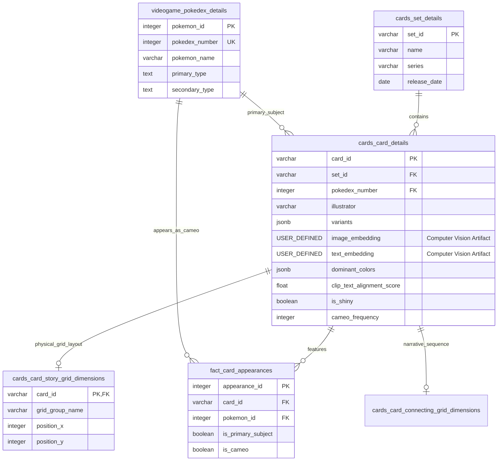

# ❖ TCG Metabase: Advanced Relational Database & Data Pipeline

> [!NOTE]  
> **Project Description:** A cloud-native PostgreSQL database and ETL pipeline designed to index, query, and visualize hyper-niche Pokemon metadata within the Pokemon Trading Card Game ecosystem. It captures complex relationships—like background cameos, vector-based color profiles, and multi-card narrative grids—that official and 3rd-party APIs fail to map.

## 📑 Table of Contents
- [Architecture & Pipeline](#-architecture--etl-pipeline)
- [Database Schema](#-database-schema--curated-metadata)
- [Engineering Journey & Strategic Pivot](#-engineering-journey--the-strategic-pivot)
- [Frontend Application](#-frontend-application)

---

## ⚙️ Architecture & ETL Pipeline

This project operates on a serverless, cloud-native architecture to ensure high availability and minimal maintenance overhead.

* **Data Orchestration (GitHub Actions):** Instead of a heavy, always-on orchestrator, the ETL pipeline relies on GitHub Actions. Scheduled workflows trigger daily Python extraction scripts that pull data, process nested API payloads, and execute database backups.
* **Cloud Data Warehouse (Supabase):** The transformed data is loaded directly into a fully managed PostgreSQL instance hosted on Supabase. This provides built-in connection pooling, instant API access, and scalable performance for complex relational queries.
* **Schema-on-Read Ingestion:** To handle unpredictable upstream API changes, raw list variables (like card variants and cameo arrays) are ingested directly into `JSONB` columns, ensuring the pipeline never breaks due to structural changes.

---

## 🗃️ Database Schema & Curated Metadata

The core engineering achievement of this platform is its highly normalized relational schema. It goes beyond basic text searches by modeling complex realities, such as cards that form larger physical images (`cards_card_story_grid_dimensions`) and junction tables for background character appearances (`fact_card_appearances`).

<b>View Database Engineering Highlights</b> (Click to expand)

* **The `fact_card_appearances` Junction Table:** Solves the many-to-many relationship problem of characters appearing in the background of other cards, allowing for complex multi-entity overlap queries.
* **Vector & ML Storage:** Features custom `USER-DEFINED` types for `image_embedding` and `text_embedding`, alongside `clip_text_alignment_score` for semantic image analysis.
* **Narrative Grid Tracking:** The `cards_card_story_grid_dimensions` table acts as a spatial matrix, allowing the frontend to reconstruct 9-card interlocking artworks perfectly using X/Y coordinate mapping.

---

## 🧭 Engineering Journey & The Strategic Pivot

> [!IMPORTANT]  
> **The Lesson:** Knowing when to deprecate an overly complex, automated ML approach in favor of a robust, human-curated relational architecture.

My initial objective was to upskill in modern data engineering and machine learning. To categorize cards by their visual art medium, I built a computer vision pipeline utilizing PyTorch (specifically CLIP models) and OCR techniques. 

* **The Experiment:** I extracted vector embeddings (`image_embedding`, `text_embedding`), analyzed `dominant_colors`, and calculated `clip_text_alignment_score` metrics to automatically bucket artwork into mediums (e.g., CGI, clay, acrylic).
* **The Roadblock:** While it worked flawlessly for highly distinct physical textures (like yarn or clay), performance degraded when attempting to classify subtle 2D mediums. The visual variance was simply too broad for an acceptable confidence threshold.

**The Pivot:** Rather than sinking further engineering time into hyperparameter tuning for a flawed model, I pivoted the project's core focus. I retained the successful color and embedding metadata, but re-architected the database around a **human-in-the-loop, highly-curated relational model**. 

This shifted the challenge to advanced data architecture—utilizing junction tables (`fact_card_appearances`) and spatial grids (`cards_card_story_grid_dimensions`) to track relationships an AI couldn't reliably parse. Ultimately, prioritizing data quality over algorithmic complexity resulted in a vastly superior, highly accurate dataset.

---

## 🖥️ Frontend Application

  

To transform this relational dataset into a fast discovery tool, I engineered a responsive web application using **Streamlit**.

* **Multi-Variable Query Engine:** Translates user inputs (cameos, illustrators, grid formations) into parameterized SQL queries executed against Supabase.
* **Aggressive Caching:** Leverages Streamlit's `st.session_state` alongside `@st.cache_data`. Connection pools to the cloud database are cached globally, keeping UI latency under 200ms despite the complex underlying JOIN operations.
* **Spatial & Relational UI:** The frontend leverages the custom grid tables to dynamically reconstruct interlocking artworks, while every metadata tag acts as an active search node for deep-dive discovery.

---
*Disclaimer: This repository is a technical portfolio project focused on data engineering, database architecture, and computer vision integration. It is strictly an unofficial, non-commercial educational project. All trading card images, character names, and related visual assets are the intellectual property of their respective owners (Nintendo, Creatures, GAME FREAK, and The Pokémon Company International) and are used here under the context of informational/educational database organization.*